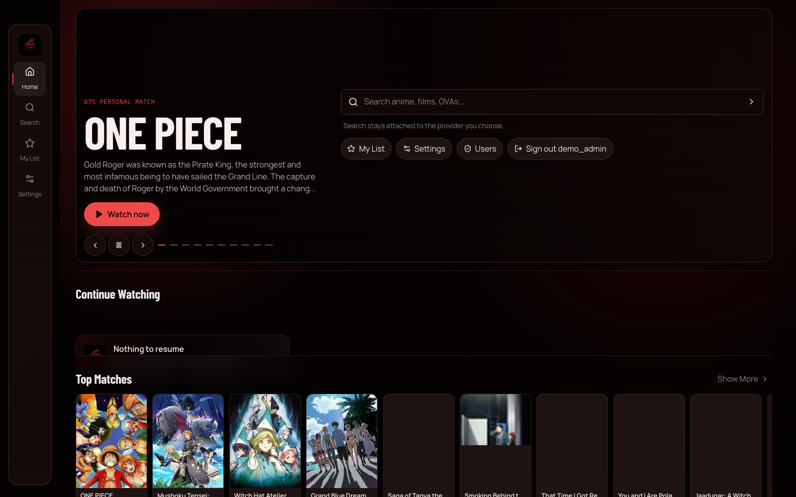
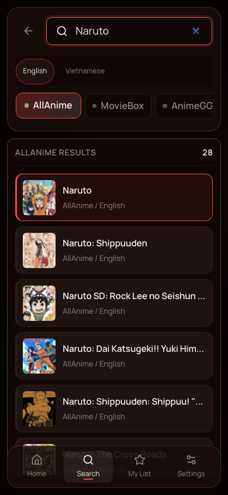
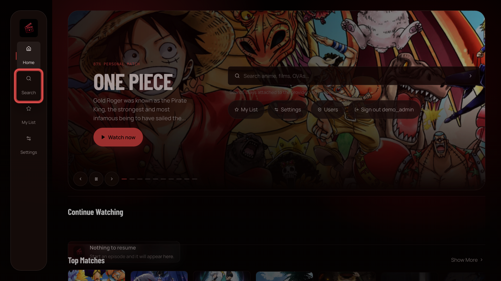

# ani-web

Private family anime streaming for desktop, mobile, and TV browsers.

**Open the web app:** [ani.dangphuc.me](https://ani.dangphuc.me)

## Use ani-web

1. Open the web app and sign in with an account created by the administrator.
2. Search for a title from Home.
3. Choose English or Vietnamese, then select a provider. Your search stays in place when you switch providers.
4. Open a result, choose an episode, and press **Watch**.
5. Use **My List** to save titles. Watch progress follows your account across signed-in browsers.

## Mobile browser

Search results, title details, episode selection, and playback adapt to a phone-sized screen.

  

## TV browser

Choose **Settings → Interface size → TV / remote**. Use the arrow keys on a remote or keyboard to move focus and press **OK/Enter** to select.

