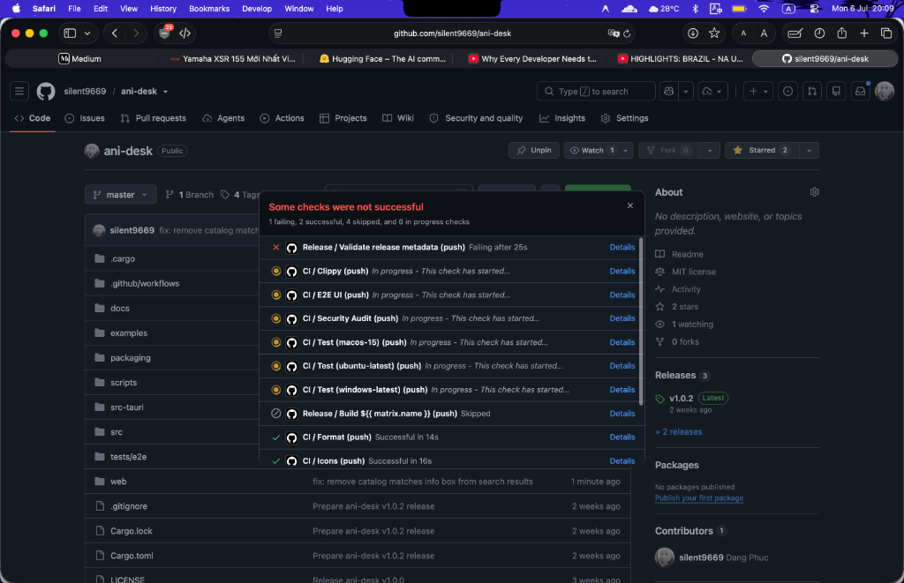

<div align="center">
  
  <h1>ani-desk</h1>
  <p>A lightweight desktop anime browser and player built with Tauri, Rust, and React.</p>
</div>

---

## 📸 Demo



## 🚀 Download & Installation

### macOS (Recommended)

Because of Apple's Gatekeeper, downloading the DMG directly from your browser will result in an "app is damaged" error since it's an ad-hoc signed app. 

The easiest and recommended way to install on macOS is via **Homebrew**:

```bash
brew install --cask silent9669/ani-desk/ani-desk
```

*If you manually download the DMG and face the "app is damaged" error, run this in your terminal:*
```bash
xattr -cr /Applications/ani-desk.app
```

### Windows & Linux

Download the latest installer from the [GitHub Releases](https://github.com/silent9669/ani-desk/releases) page.
- **Windows**: Download the `.msi` or `.exe` installer.
- **Linux**: Download the `.AppImage`, `.deb`, or `.rpm`.

---

## ✨ Features

- **Provider-First Search**: Fast and accurate search directly querying your favorite providers, improved by your watch history.
- **Compact UI**: Netflix-style home page with Trending, Continue Watching, and My List sections.
- **Built-in Player**: HLS/DASH/MP4 playback with subtitles, quality selection, and saved progress.
- **Cross-Platform**: Available on macOS, Windows, and Linux.

## 🛠️ Development

To build and run the app locally:

```bash
npm ci
npm run tauri dev
```
