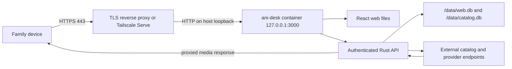

# ani-desk homelab deployment and operations

> This is the original single-container/Tailscale guide. For the production
> Caddy deployment, CI-gated updates, data-preserving rollback, monitoring, and
> incident response, use `docs/ANI_WEB_HOMELAB_HANDBOOK.md`.

This guide explains how to deploy, secure, inspect, back up, update, and recover
the hosted ani-desk service from a command line. It describes operations and
networking, not application code.

The hosted service is intended for a private family of roughly 5–10 users. Keep
the repository private if it contains homelab notes, but never commit the real
`.env.homelab` file, passwords, cookies, databases, or provider media URLs.

## Repository decision

Keep the desktop app and homelab service in this repository.

They share the React interface, Rust provider engine, database types, playback
logic, tests, and release history. A second repository would duplicate fixes and
make it easier for desktop and web provider behavior to drift. The repository
already has two independent delivery targets:

- Tauri packages for a local desktop installation.
- One container image for the authenticated hosted service.

Create a separate repository only if the hosted service later has a different
owner, a different security review/release schedule, or becomes a public service
whose provider code must be isolated from the desktop client.

## Runtime map



The raw application port is deliberately bound to `127.0.0.1`. It is not a
public entry point. HTTPS terminates at a reverse proxy or a private overlay
network. The browser receives an HttpOnly session cookie. Provider headers and
upstream media URLs remain on the server; HLS, DASH, subtitle, and segment
requests use opaque, account-bound, six-hour proxy tokens.

## Host requirements

- A Linux, macOS, or NAS host that can run Docker Engine and Docker Compose v2.
- Persistent storage with enough space for two SQLite databases and backups.
- Accurate system time through NTP. Cookie expiry and provider signatures depend
  on a correct clock.
- Outbound DNS and HTTPS access to provider/catalog services.
- One of these access patterns:
  - Recommended for only family devices: Tailscale Serve.
  - Recommended for a normal home domain: Caddy or another TLS reverse proxy.
- A password manager for the protected administrator credential.

Check the host before the first build:

```bash
docker version
docker compose version
timedatectl status
df -h .
```

On macOS, `timedatectl` is unavailable; use `systemsetup -getusingnetworktime`
instead.

## First deployment

These commands build locally. They do not publish an image or deploy anywhere
outside the homelab host.

```bash
git clone https://github.com/<your-account>/ani-desk.git
cd ani-desk
cp .env.homelab.example .env.homelab
chmod 600 .env.homelab
```

Edit `.env.homelab` and replace the administrator password. Generate a value
without printing it into shell history:

```bash
openssl rand -base64 32
```

Store the result in the password manager and then in `.env.homelab`. Start the
service:

```bash
docker compose config --quiet
docker compose build --pull
docker compose up -d
docker compose ps
curl --fail http://127.0.0.1:3000/api/health
```

Expected health response:

```json
{"service":"ani-desk","status":"ok"}
```

The container runs as the unprivileged `ani-desk` user. `./data` is the only
persistent application directory. The first start creates the protected admin
account from `.env.homelab`.

## HTTPS access

### Option A — Tailscale Serve

This is the simplest private-family setup. Install Tailscale on the server and
family devices, authenticate them to the same tailnet, and keep port 3000 bound
to loopback.

```bash
tailscale status
sudo tailscale serve --bg http://127.0.0.1:3000
tailscale serve status
```

Open the HTTPS URL shown by `tailscale serve status`. Do not add a router port
forward. Keep `ANI_DESK_SECURE_COOKIES=1`.

To stop publishing through the tailnet:

```bash
sudo tailscale serve reset
```

### Option B — Caddy with a home domain

Point a DNS name at the reverse proxy and proxy it to the loopback service. A
minimal Caddy site block is:

```text
anime.example.net {
    reverse_proxy 127.0.0.1:3000
}
```

Validate and reload Caddy from the command line:

```bash
sudo caddy validate --config /etc/caddy/Caddyfile
sudo systemctl reload caddy
sudo journalctl -u caddy -n 100 --no-pager
curl --fail https://anime.example.net/api/health
```

If the site is exposed through the public internet, restrict it with the reverse
proxy, a VPN, or an identity-aware gateway. ani-desk login is a necessary app
boundary, but it is not a reason to expose the raw container port.

## Firewall and network checks

The normal public listening set is TCP 443 on the reverse proxy. Port 3000 must
remain loopback-only.

```bash
docker compose port web 3000
ss -ltnp | grep -E '(:443|:3000)'
curl -I http://127.0.0.1:3000/
curl -I https://anime.example.net/
```

`docker compose port web 3000` should report `127.0.0.1:3000`. If it reports
`0.0.0.0:3000`, stop and correct `compose.yaml` before continuing.

Provider calls are outbound HTTPS. The hosted server also proxies HLS, DASH,
subtitles, and native media so browsers do not receive provider authentication
headers or upstream media addresses. DNS or outbound TLS failures can therefore
make providers look offline even while `/api/health` remains healthy.

## Daily command-line monitoring

Service and container state:

```bash
docker compose ps
docker inspect --format '{{json .State.Health}}' ani-desk-web-1 | jq
docker stats ani-desk-web-1
```

Live logs and a bounded incident snapshot:

```bash
docker compose logs -f --tail=200 web
docker compose logs --since=30m --timestamps web > ani-desk-incident.log
```

Health, TLS, disk, and restart count:

```bash
curl --fail --silent https://anime.example.net/api/health | jq
openssl s_client -connect anime.example.net:443 -servername anime.example.net </dev/null 2>/dev/null | openssl x509 -noout -dates -issuer -subject
du -sh data
df -h .
docker inspect --format 'restarts={{.RestartCount}} started={{.State.StartedAt}}' ani-desk-web-1
```

For a lightweight terminal dashboard:

```bash
watch -n 15 'docker compose ps; printf "\n"; curl -fsS https://anime.example.net/api/health; printf "\n\n"; df -h . | tail -1'
```

Do not enable debug/trace logging for normal operation. Provider and playback
traffic can contain signed or short-lived URLs. Keep production at:

```text
RUST_LOG=ani_desk_server=info,tower_http=info
```

## What health means

`GET /api/health` proves that the HTTP process and router are responding. It does
not prove that every external provider can search and play.

Use three separate signals:

1. Container health: `docker compose ps` reports `healthy`.
2. Application health: `/api/health` returns HTTP 200.
3. Provider health: after login, Settings reports Healthy, Limited, Verify, or
   Offline for each source. A provider is Healthy only after a media probe.

AllAnime can require manual verification when Cloudflare intervenes. That is a
provider incident, not necessarily an ani-desk server incident. Open its verify
action from Settings, complete the check, return, and retry.

## User and session operations

The protected administrator is controlled by `.env.homelab`. Changing its
username or password and restarting updates that account and invalidates its old
sessions:

```bash
chmod 600 .env.homelab
docker compose up -d --force-recreate web
docker compose logs --tail=100 web
```

Create, disable, promote, or reset other family accounts in the in-app Users
screen. Do not share the protected administrator account for daily viewing.

Browser sessions last up to 30 days. Logging out deletes the current session.
Password changes invalidate that user’s existing sessions.

## Backups

Back up all of `./data`, not individual guessed files. It contains account,
session, watch-history, favorites, and catalog cache databases.

The safest simple backup for 5–10 users is a short stopped snapshot:

```bash
mkdir -p backups
docker compose stop web
tar -C . -czf "backups/ani-desk-data-$(date +%F-%H%M%S).tgz" data
docker compose start web
curl --fail http://127.0.0.1:3000/api/health
```

Copy backups to a different physical device or encrypted remote destination.
Keeping archives on the same disk is not disaster recovery.

List and test an archive without restoring it:

```bash
ls -lh backups/
tar -tzf backups/ani-desk-data-YYYY-MM-DD-HHMMSS.tgz | head
gzip -t backups/ani-desk-data-YYYY-MM-DD-HHMMSS.tgz
```

A practical retention policy for this small service is seven daily, four weekly,
and six monthly archives. Monitor the backup command’s exit code and archive
size; a zero-byte or suddenly tiny archive is a failed backup even if the job ran.

## Restore drill

Perform restore drills on a test host or test directory. For a real restore:

```bash
docker compose down
mv data "data.before-restore-$(date +%F-%H%M%S)"
tar -xzf backups/ani-desk-data-YYYY-MM-DD-HHMMSS.tgz
docker compose up -d
docker compose ps
curl --fail http://127.0.0.1:3000/api/health
```

Then sign in with a non-admin family account and verify My List and Continue
Watching. Keep the pre-restore directory until this check passes.

## Safe updates and rollback

Before updating, record the exact revision and take a backup:

```bash
git rev-parse HEAD
git status --short
docker compose images
```

Use a clean checkout for deployment. Do not pull over local uncommitted changes.

```bash
git fetch --tags origin
git log --oneline --decorate -n 10 origin/master
docker compose stop web
tar -C . -czf "backups/pre-update-$(date +%F-%H%M%S).tgz" data
git pull --ff-only
docker compose build --pull
docker compose up -d
docker compose ps
curl --fail http://127.0.0.1:3000/api/health
docker compose logs --tail=150 web
```

Rollback means checking out the previously recorded revision, rebuilding, and
starting against the preserved data. If the update changed the database schema,
also restore the pre-update data archive; do not run an older binary against a
newer database and assume compatibility.

## Incident playbook

| Symptom | First commands | Likely boundary |
| --- | --- | --- |
| Site does not open | `docker compose ps`; proxy status; `ss -ltnp` | Container, proxy, DNS, or firewall |
| HTTPS warning | `openssl s_client ...`; proxy logs | Certificate renewal or DNS |
| Login rejected for everyone | container logs; inspect `.env.homelab`; restart count | Admin secret, database, or rate limit |
| One user cannot log in | Users screen; bounded logs | Disabled account, password, expired session |
| Health is OK but search fails | Settings provider health; DNS test; logs | External catalog/provider |
| AllAnime says Verify | use the manual verify action | Cloudflare/provider boundary |
| Playback starts then stalls | logs; browser network; provider health | Provider CDN or media proxy |
| Container restarts | `docker inspect`; logs; `df -h`; `docker stats` | Crash, memory, or full disk |
| History disappears | check mounted `./data`; stop writes; restore plan | Wrong volume or data loss |

When collecting evidence, save timestamps, container revision, HTTP status,
restart count, and a bounded log window. Redact Cookie, Authorization, password,
session token, and signed media query values before sharing an incident file.

## Shutdown and removal

Stop without deleting data:

```bash
docker compose stop
```

Remove the container and network while keeping `./data`:

```bash
docker compose down
```

Do not add `--volumes` casually. The current bind mount is visible as `./data`,
but destructive cleanup commands should still be preceded by a verified backup.

## Pre-production checklist

- [ ] Real `.env.homelab` is mode 600 and absent from Git.
- [ ] Administrator password is unique and stored in a password manager.
- [ ] `ANI_DESK_SECURE_COOKIES=1`.
- [ ] Port 3000 reports `127.0.0.1`, not `0.0.0.0`.
- [ ] Family access uses HTTPS through Tailscale Serve or a TLS reverse proxy.
- [ ] Router has no direct port-forward to container port 3000.
- [ ] Container, application, and provider health are checked independently.
- [ ] Backup and restore drill has passed.
- [ ] Logs are info-level and retained for a bounded period.
- [ ] A non-admin daily account exists for each family member.
- [ ] Update and rollback revisions are recorded before every upgrade.
